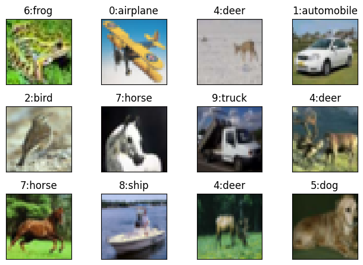

# ERA V1 Session 8

## Code Structure

### 1. datasets.py Module
The datasets module contains a generic dataset class which creates train and test loaders and can visualise examples with labels.

We have two datasets currently in the modeule MNIST and CIFAR10 but can easily be extended with more datasets.



### 2. model.py Module
This file contains various models we have tried over CIFAR10 dataset and also previous MNIST models from session 7. The CIFAR10 Models are implemented using residual connections.

The ConvLayer class implements a small building block which is as follows:
```bazaar
X -> Convolution -> Normalisation -> + X -> RelU -> Dropout
```
The +X indicates skip connection where we add input of same shape to normalised output of convolution. Also the Normalisation, Skip connection and dropout are optional.
```python
def forward(self, x):
    x_ = x
    x = self.convlayer(x)
    if self.normlayer is not None:
        x = self.normlayer(x)
    if self.skip:
        x += x_
    x = self.actlayer(x)
    if self.droplayer is not None:
        x = self.droplayer(x)
    return x
```
 In case of normalisation multiple options are available:
```python
def get_norm_layer(self, c):
    if self.norm_type == 'batch':
        # Batch Normalisation
        return nn.BatchNorm2d(c)
    elif self.norm_type == 'layer':
        # Layer Normalisation
        return nn.GroupNorm(1, c)
    elif self.norm_type == 'group':
        # Group Normalisation
        return nn.GroupNorm(self.n_groups, c)
    elif self.norm_type == 'instance':
        # Instance Normalisation
        return nn.GroupNorm(c, c)
    else:
        raise Exception(f'Unknown norm_type: {self.norm_type}')
```
And finally model is put together in class Model.

#### Receptive field Calculations:

| Layer | Input Size | Input RF | Jump In | Padding | Kernel Size | Stride | Output Size | Output RF | Jump Out |
|-------| ---------- | -------- | ------- | ------- | ----------- | ------ | ----------- | --------- | -------- |
| Input | 32         | 1        | 1       | 0       | 1           | 1      | 32          | 1         | 1        |
| 1     | 32         | 1        | 1       | 0       | 3           | 1      | 30          | 3         | 1        |
| 2     | 30         | 3        | 1       | 0       | 3           | 1      | 28          | 5         | 1        |
| 3     | 28         | 5        | 1       | 0       | 1           | 1      | 28          | 5         | 1        |
| 4     | 28         | 5        | 1       | 0       | 2           | 2      | 14          | 6         | 2        |
| 5     | 14         | 6        | 2       | 1       | 3           | 1      | 14          | 10        | 2        |
| 6     | 14         | 10       | 2       | 1       | 3           | 1      | 14          | 14        | 2        |
| 7     | 14         | 14       | 2       | 1       | 3           | 1      | 14          | 18        | 2        |
| 8     | 14         | 18       | 2       | 0       | 1           | 1      | 14          | 18        | 2        |
| 9     | 14         | 18       | 2       | 0       | 2           | 2      | 7           | 20        | 4        |
| 10    | 7          | 20       | 4       | 1       | 3           | 1      | 7           | 28        | 4        |
| 11    | 7          | 28       | 4       | 1       | 3           | 1      | 7           | 36        | 4        |
| 12    | 7          | 36       | 4       | 1       | 3           | 1      | 7           | 44        | 4        |
| 13    | 7          | 44       | 4       | 0       | 7           | 7      | 1           | 68        | 28       |
| 14    | 1          | 68       | 28      | 0       | 1           | 1      | 1           | 68        | 28       |

### 3. backprop.py Module
This module contains 3 classes:
1. Experiment
2. Train
3. Test

Experiment class performs train-test iterations for a given number of epochs. It can also find and plot misclassified examples using a simple function.

Train and Test classes perform training and testing respectively on given model and dataset. They also accumulate statistics which can be plotted using a simple member functions.

### 4. utils.py Modele
This module contains miscellaneous functions like detecting device and setting random seed.

## The Results

### 1. Group Normalisation
Best Train Accuracy: 70.81%

Best Test Accuracy: 72.84%


Misclassified Images:


### 2. Layer Normalisation
Best Train Accuracy: 68.60%

Best Test Accuracy: 70.58%


Misclassified Images:


### 3. Batch Normalisation
Best Train Accuracy: 75.22%

Best Test Accuracy: 78.13%


Misclassified Images:


### Analysis of different Normalisation techniques
Group Normalisation performs normalisation in small groups of channels for a given image. As number of groups increase, it has a better regularising effect.

Layer Normalisation is performing worst since it is doing normalisation across all channels of each image. This is a special case of Group Normalisation with just 1 group.

Batch Normalisation performs normalisation for each channel across all images of a batch.

Layer Normalisation is ill-equipped to address Internal Covariate Shift (ICS) in CNNs since it normalises each image independently.

Thus batch normalisation is performing the best here since normalisation is done on a channel for entire batch, that too on images which are shuffled in train loader, thus better correcting ICS.
