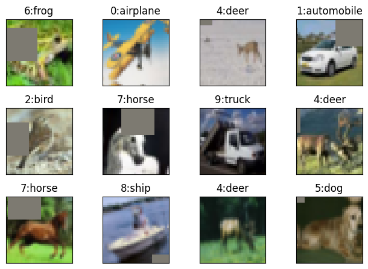
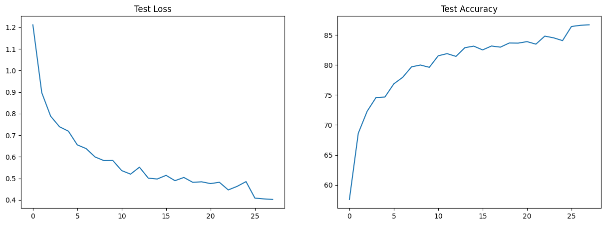

# ERA V1 Session 9

## Code Structure

### 1a. datasets/generic.py Module
The datasets module contains a generic MyDataSet class which creates train and test loaders and can visualise examples with labels.
It also performs basic transforms like Normalize and ToTensorV2.

We have two datasets currently in the modeule MNIST and CIFAR10 but can easily be extended with more datasets.


### 1b. datasets/cifar10.py Module
This module inherits the generic module and applies operations specific to cifar10 which include the Image Augmentations.
Image Augmentations used:
```python
import albumentations as A

alb_transforms = [
    A.Normalize(mean, std),
    A.Downscale(0.8, 0.95, p=0.2),
    A.ColorJitter(0.1, 0.1, 0.1, 0.1, p=0.2),
    A.ToGray(p=0.1),
    A.HorizontalFlip(p=0.5),
    A.ShiftScaleRotate(shift_limit=0.0625, scale_limit=0.1, rotate_limit=15),
    # Since normalisation was the first step, mean is already 0, so fill_value = 0
    A.CoarseDropout(max_holes=1, max_height=16, max_width=16, p=0.2, fill_value=0),
    A.pytorch.ToTensorV2()
]
```



### 2. model.py Module
The model has following unique properties:
1. It does NOT use any Maxpool or Strided convolutions for increasing RF.
2. It uses ONLY dilation for increasing RF.
3. It has 4 (convolution + transition) blocks.
4. ALL Convolution blocks make use of Depthwise Separable Convolutions.
5. All Convolution blocks use Skip Connections internally.

The Depthwise Separable Convolution is implemented using a small building block which is as follows:

```python
self.convlayer = n.Sequential(
    nn.Conv2d(input_c, output_c, 3, bias=bias, padding=padding, groups=input_c, dilation=dilation,
              padding_mode='replicate'),
    nn.BatchNorm2d(output_c),
    nn.ReLU(),
    nn.Conv2d(output_c, output_c, 1, bias=bias),
)
```
The skip connection is implemented in forward function as below.

```python
def forward(self, x):
    x_ = x
    x = self.convlayer(x)
    x = self.normlayer(x)
    if self.skip:
        x += x_
    x = self.actlayer(x)
    if self.droplayer is not None:
        x = self.droplayer(x)
    return x
```
And finally model is put together in class Model.

#### Receptive field Calculations:

| Layer | Input Size | Input RF | Jump In | Padding | Kernel Size | Dilation | Eff. Kernel Size | Stride | Output Size | Output RF | Jump Out |
| ----- | ---------- | -------- | ------- | ------- | ----------- | -------- | ---------------- | ------ | ----------- | --------- | -------- |
| 0     | 32         | 1        | 1       | 0       | 1           | 1        | 1                | 1      | 32          | 1         | 1        |
| 1     | 32         | 1        | 1       | 1       | 3           | 1        | 3                | 1      | 32          | 3         | 1        |
| 2     | 32         | 3        | 1       | 1       | 3           | 1        | 3                | 1      | 32          | 5         | 1        |
| 3     | 32         | 5        | 1       | 0       | 3           | 1        | 3                | 1      | 30          | 7         | 1        |
| 4     | 30         | 7        | 1       | 1       | 3           | 1        | 3                | 1      | 30          | 9         | 1        |
| 5     | 30         | 9        | 1       | 1       | 3           | 1        | 3                | 1      | 30          | 11        | 1        |
| 6     | 30         | 11       | 1       | 0       | 3           | 2        | 5                | 1      | 26          | 15        | 1        |
| 7     | 26         | 15       | 1       | 1       | 3           | 1        | 3                | 1      | 26          | 17        | 1        |
| 8     | 26         | 17       | 1       | 1       | 3           | 1        | 3                | 1      | 26          | 19        | 1        |
| 9     | 26         | 19       | 1       | 0       | 3           | 4        | 9                | 1      | 18          | 27        | 1        |
| 10    | 18         | 27       | 1       | 1       | 3           | 1        | 3                | 1      | 18          | 29        | 1        |
| 11    | 18         | 29       | 1       | 1       | 3           | 1        | 3                | 1      | 18          | 31        | 1        |
| 12    | 18         | 31       | 1       | 0       | 3           | 8        | 17               | 1      | 2           | 47        | 1        |
| 13    | 2          | 47       | 1       | 0       | 2           | 1        | 2                | 2      | 1           | 48        | 2        |
| 14    | 1          | 48       | 2       | 0       | 1           | 1        | 1                | 1      | 1           | 48        | 2        |

### 3. backprop.py Module
This module contains 3 classes:
1. Experiment
2. Train
3. Test

Experiment class performs train-test iterations for a given number of epochs or a given validation target. It can also find and plot misclassified examples using a simple function.

Train and Test classes perform training and testing respectively on given model and dataset. They also accumulate statistics which can be plotted using a simple member functions.

### 4. utils.py Modele
This module contains miscellaneous functions like detecting device and setting random seed.

## The Results

Best Train Accuracy: 78.34%

Best Test Accuracy: 85.25%




Misclassified Images:


